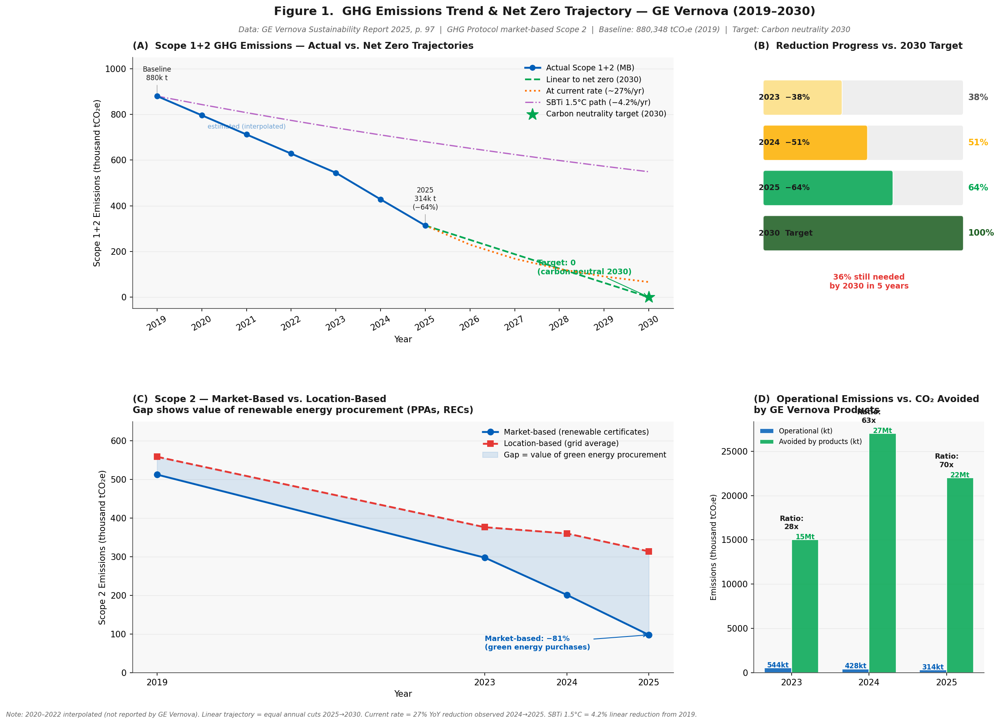
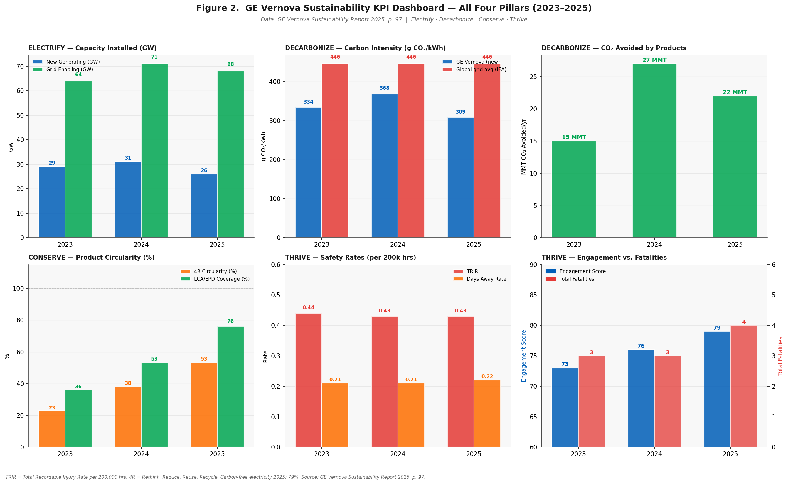

# GE Vernova — GHG Emissions Trend & Sustainability KPI Dashboard

A Python data analysis project tracking GE Vernova's greenhouse gas emissions trajectory and sustainability KPIs across all four reporting pillars (Electrify, Decarbonize, Conserve, Thrive). Includes net zero trajectory modelling toward their 2030 carbon neutrality target.

Data extracted directly from the GE Vernova Sustainability Report 2025 (p. 97).

---

## What it covers

- Scope 1+2 emissions trend from 2019 baseline to 2025 (−64% reduction)
- Three net zero trajectory models to 2030: linear path, current rate (−27%/yr), SBTi 1.5°C path
- Scope 2 market-based vs location-based comparison — showing the value of renewable energy procurement
- CO₂ avoided by GE Vernova products vs operational footprint (ratio: 70x)
- Full KPI dashboard across all four sustainability pillars

---

## Key Findings

| Metric | Value |
|--------|-------|
| 2019 baseline (Scope 1+2 MB) | 880,348 tCO₂e |
| 2025 actual (Scope 1+2 MB) | 313,659 tCO₂e |
| Reduction since 2019 | **−64%** |
| YoY reduction 2024→2025 | **−27%** |
| At current pace by 2030 | ~65,000 tCO₂e — on track for carbon neutrality |
| CO₂ avoided by products (2025) | 22 MMT/yr — **70x operational footprint** |
| Carbon-free electricity (2025) | 79% |
| New generating capacity (2025) | 26 GW |

---

## Figures

### Figure 1 — GHG Trajectory & Net Zero Modelling


### Figure 2 — Full KPI Dashboard


---

## Data Source

| Field | Detail |
|-------|--------|
| Source | GE Vernova Sustainability Report 2025 |
| Page | p. 97 — Performance data table |
| GHG method | GHG Protocol, market-based Scope 2 |
| 2030 target | Carbon neutrality (Scope 1+2) |
| Auditor | Third-party limited assurance (2025) |

---

## How to Run

```bash
pip install pandas matplotlib openpyxl numpy

# Open in Spyder and press F5
# or from terminal:
python gev_kpi_dashboard.py
```

Figures and Excel saved to `output/`.

---

## Project Structure

```
gev-ghg-kpi-dashboard/
├── gev_kpi_dashboard.py
├── requirements.txt
├── README.md
└── .gitignore
```

---

## Methodology

| Item | Detail |
|------|--------|
| GHG standard | GHG Protocol Corporate Accounting Standard |
| Scope 2 method | Market-based |
| Linear trajectory | Equal annual cuts from 313,659 → 0 tCO₂e (2025–2030) |
| Current rate model | 27% YoY reduction applied 2025–2030 |
| SBTi 1.5°C path | 4.2% linear annual reduction from 2019 baseline |
